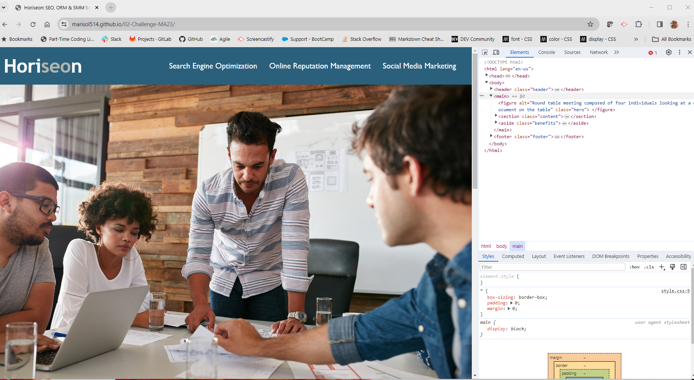
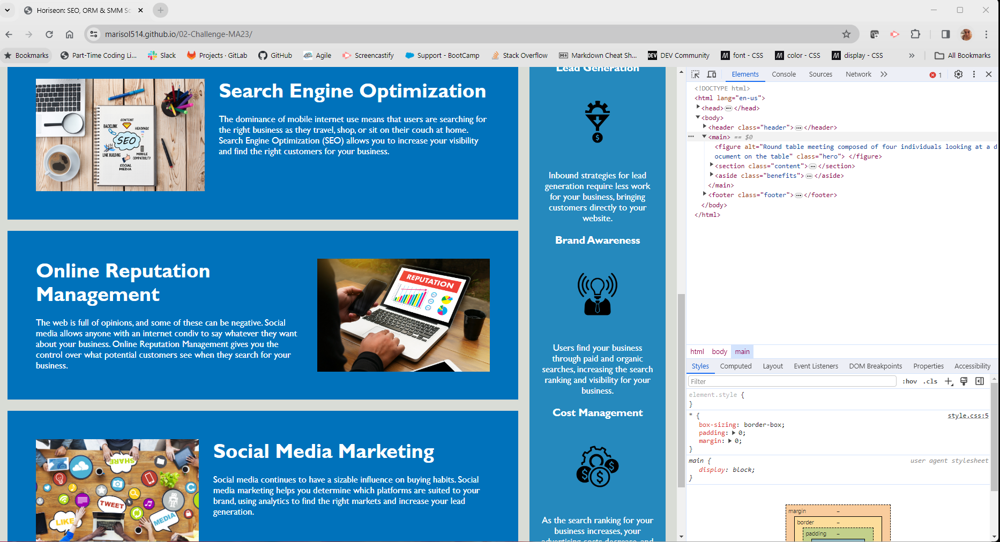
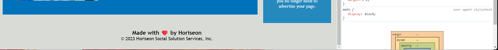

# 02-Challenge-MA23
UCI-VIT-FSF-PT-12-2023-U-LOLC
## 02-HTML-git-CSS - 02 Challenge

## Description
Begining with started code, the challange was to modify the code to improve whithout changing what it does. The challange is due on Thursday Dec 21, 2023. 

The challange will also require that I ensure that all the links are functional, CSS selectors are consolidated. It will require me to add a unique name, and to meet the acceptance criteria.

## User Story
```
AS A marketing agency
I WANT a codebase that follows accessibility standards
SO THAT our own site is optimized for search engines
```
## Acceptance Criteria

```
GIVEN a webpage meets accessibility standards
WHEN I view the source code
THEN I find semantic HTML elements
WHEN I view the structure of the HTML elements
THEN I find that the elements follow a logical structure independent of styling and positioning
WHEN I view the icon and image elements
THEN I find accessible alt attributes
WHEN I view the heading attributes
THEN they fall in sequential order
WHEN I view the title element
THEN I find a concise, descriptive title
```

## Screen Shots:




## Review Links: 

Deployed Application Link: https://marisol514.github.io/02-Challenge-MA23/

URL GitHub Repository: https://github.com/Marisol514/02-Challenge-MA23


## Acknowkedgements:
Worked with and referenced the work of classmates : Ryan Sarat, Daniel Merino, Jacob Rerraro, Amanda Vilwock, Sarah Davila and Tub Vaaj

## Resources: 

Sematich HTML Structure Information Links: 
https://dev.to/5t3ph/semantic-html-structure-1adn#:~:text=In%20this%20post%2C%20we%20will,as%20we%20cover%20our%20examples. 

https://www.simplilearn.com/tutorials/html-tutorial/html-semantics#:~:text=The%20HTML%20semantics%20refers%20to,and%20layout%20of%20web%20pages.

https://developer.mozilla.org/en-US/docs/Glossary/Semantics#semantics_in_html

https://developer.mozilla.org/en-US/docs/Web/HTML/Element#inline_text_semantics

Accessible Alt Attribute Links:
https://moz.com/learn/seo/alt-text#:~:text=Adding%20alternative%20text%20to%20images,the%20images%20on%20the%20page.

https://www.w3schools.com/tags/att_img_alt.asp

Sequential Order of Heading Attributes: 

https://developer.mozilla.org/en-US/docs/Web/HTML/Element/Heading_Elements  

Concise Descriptive Title Information: 

https://developer.mozilla.org/en-US/docs/Web/HTML/Element/Heading_Elements

Aside Tag: 

https://stackoverflow.com/questions/21927767/how-do-i-correctly-place-an-aside-tag

README:

https://gist.github.com/DomPizzie/7a5ff55ffa9081f2de27c315f5018afc

